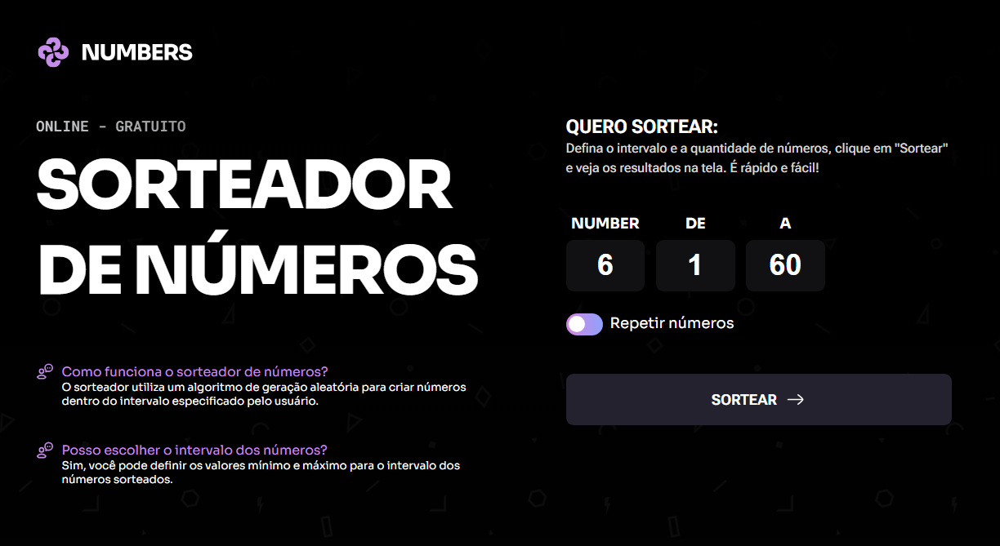

# Desafio prático - App sorteador de números.

> Trilha FullStack - Projeto feito para cumprir Desafio prático - App sorteador de números - Rocketseat :rocket:.

## :dart: Desafio

- Javascript
- ## Sortear números 

- O usuário pode escolher a quantidade de números a serem sorteados junto com o número inicial e final que fará parte desse sorteio, caso queira pode fazer novo sorteio.
- Criação de layouts com CSS;
- CSS Flexbox;
- Posicionamento de elementos;
- CSS Grid;
- Variáveis CSS;
- pseudo-class e pseudo-elements;
- Formulários HTML;
- Input de texto;
- Estilização de inputs com CSS;
- Input de data;
- Estilização de formulários com CSS;

## :hammer_and_wrench: Tecnologias

- HTML;
- CSS;
- Javascript
- Git e Github;

## :trophy: Neste projeto aprendi

- JavaScript - selecionar os elementos do projeto de diversas maneiras.
- Criar funções e reaproveitá-las.
- Criar elementos html dinamicamente durante o uso do aplicativo.

- Semântica em HTML
- Box Model
- Display GRID
- Acessibilidade
- Tags semanticas

- Entidade que regulamenta a semantica no Brasil [W3C](https://www.w3c.br/Padroes/WebSemantica)
- Conceito da programação chamado <b>REFATORAÇÃO</b>: mudar algo interno na página sem estragar o que esta funcionando, é feito com a intenção de melhorar algo interno no código do site.

- Trabalhamos com alinhamento e espaçamento dos elementos

- Pseudo classes

- background linear-gradient
- Analizar um projeto com design feito no Figma;
- Usar fontes do Google Fonts;
- Posicionar os elementos na tela usando a propriedade
 <strong>position: absolute, relative e fixed</strong>;

## :mailbox_closed: Contatos

> Email - rosendc30@gmail.com

> Linkedin - https://www.linkedin.com/in/francisco-rosendo-a05623241
